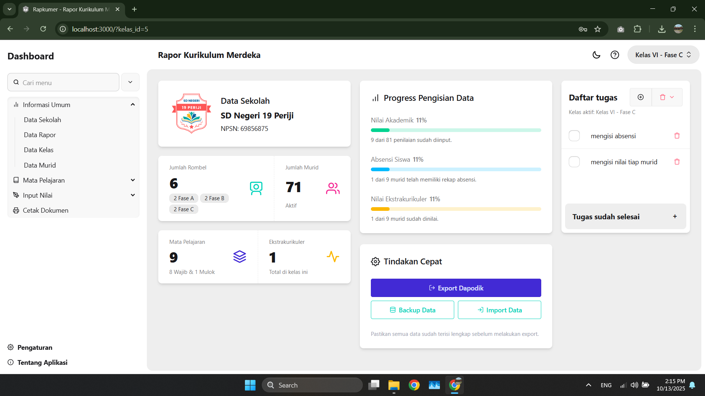

# Rapkumer



<a href='https://nodejs.org/en' target="_blank"></a> <a href='https://svelte.dev/' target="_blank"></a> <a href='https://orm.drizzle.team/' target="_blank"></a> <a href='https://sqlite.org/' target="_blank"></a> <a href='https://tailwindcss.com/' target="_blank"></a> <a href='https://daisyui.com/' target="_blank"></a>

Rapkumer adalah aplikasi web untuk membantu sekolah menyiapkan rapor berbasis Kurikulum Merdeka. Aplikasi
memfokuskan proses pengisian data oleh guru dan operator sekolah sehingga format dan cetakan rapor menjadi
lebih konsisten dan siap cetak.

Dokumentasi lengkap proyek disusun dalam bahasa Indonesia. File ini memberi ringkasan cepat untuk pengguna
dan pengembang; bagian teknis dan pedoman kontribusi ada di folder `docs/`.

## Fitur Utama

- Mengelola data sekolah, kelas, pegawai, murid, dan mata pelajaran
- Input nilai formatif dan sumatif sesuai asesmen yang tersedia
- Menyimpan catatan wali kelas dan informasi kehadiran
- Mencetak rapor, piagam, dan dokumen pendukung yang siap cetak

## Siapa yang Cocok Menggunakan

- Kepala sekolah, guru, wali kelas, dan operator sekolah yang bertanggung jawab atas administrasi rapor

## Quickstart — Versi Pengguna (Windows installer)

1. Kunjungi halaman rilis: https://github.com/sira313/raporkumer/releases
2. Unduh `RapkumerSetup.exe` dan jalankan installer.
3. Setelah terpasang, buka aplikasi dari shortcut yang tersedia.

Untuk instruksi instalasi manual dan pengembangan, baca [docs/DEVELOPMENT.md](https://github.com/sira313/raporkumer/blob/main/docs/DEVELOPMENT.md).

## Menjalankan Versi Pengembangan (untuk pengembang)

Persyaratan:

- Node.js 20 LTS (direkomendasikan)
- pnpm

Langkah singkat:

```bash
pnpm install
pnpm dev -- --port 5173
```

Buka http://localhost:5173 di browser. Jika port 5173 sudah digunakan, jalankan dengan `--port 5174`.

Beberapa skrip penting (lihat `package.json`):

- `pnpm dev` — jalankan server pengembangan (script `node scripts/dev.js` yang juga menjalankan generator ikon)
- `pnpm build` — buat build produksi
- `pnpm db:push` — jalankan migrasi database (Drizzle)
- `pnpm db:studio` — buka Drizzle Studio untuk inspeksi database
- `pnpm lint` dan `pnpm check` — cek format, lint, dan tipe Svelte

Lokasi database lokal: `data/database.sqlite3`.

## Struktur Proyek (singkat)

- `src/` — kode sumber SvelteKit (komponen, rute, server)
- `static/` — aset statis yang disajikan apa adanya
- `scripts/` — skrip utilitas (migrasi, seed, generator ikon)
- `data/` — file database lokal dan upload
- `drizzle/` — file migrasi SQL yang digunakan oleh Drizzle

Lebih detil tentang pola implementasi (Svelte 5 runes, DaisyUI, Tailwind v4, Drizzle ORM) ada di
[docs/DEVELOPMENT.md](https://github.com/sira313/raporkumer/blob/main/docs/DEVELOPMENT.md).

## Lisensi & Pengecualian

Konten proyek ini berada di bawah lisensi Creative Commons Attribution-NonCommercial-ShareAlike 4.0
(CC BY-NC-SA 4.0). Namun, ada beberapa aset statis yang dikecualikan dari cakupan lisensi ini — lihat
[docs/LICENSING.md](https://github.com/sira313/raporkumer/blob/main/docs/CODE_SIGNING.md) dan file `LICENSE-CC-BY-NC-SA-4.0.md` di root untuk detail lengkap.

Ikon pada `src/lib/icons` berasal dari [Feather](https://github.com/feathericons/feather) dan dirilis di bawah
lisensi MIT — rincian dan kredit ada di [docs/ICON-CREDITS.md](https://github.com/sira313/raporkumer/blob/main/docs/ICON-CREDITS.md).

## Kontribusi

Terima kasih jika Anda ingin berkontribusi!

- Ikuti panduan kode dan gunakan `pnpm lint` + `pnpm check` sebelum mengirim PR.
- Gunakan bahasa Indonesia untuk user-facing copy (teks antarmuka dan dokumentasi pengguna).
- Tambahkan tes kecil atau deskripsi manual langkah verifikasi bila mengubah fungsionalitas kritis.

Lihat [docs/DEVELOPMENT.md](https://github.com/sira313/raporkumer/blob/main/docs/DEVELOPMENT.md) untuk alur kerja development yang disarankan dan skrip helper.

## Bantuan

Jika menemukan masalah, buka issue di GitHub repo atau hubungi pemilik/kontributor yang tercantum di halaman
release atau dalam file [docs/](https://github.com/sira313/raporkumer/blob/main/docs/).
