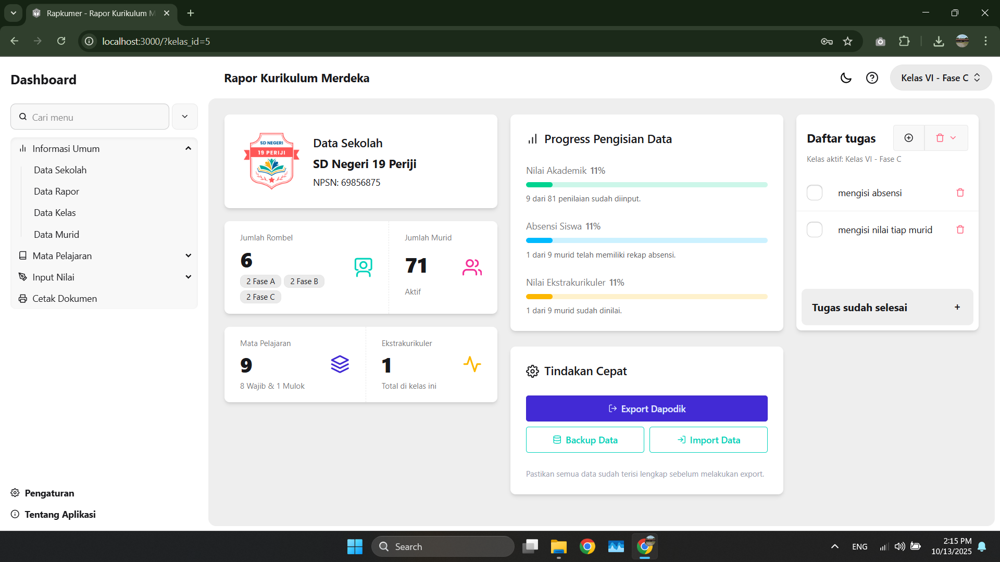

# Rapkumer



<a href='https://nodejs.org/en' target="_blank"></a> <a href='https://svelte.dev/' target="_blank"></a> <a href='https://orm.drizzle.team/' target="_blank"></a> <a href='https://sqlite.org/' target="_blank"></a> <a href='https://tailwindcss.com/' target="_blank"></a> <a href='https://daisyui.com/' target="_blank"></a>

> Rapkumer awalnya dibuat sebagai alternatif E-Rapor Kurikulum Merdeka.

Seiring perkembangannya, Rapkumer kini menjadi aplikasi terpadu yang membantu berbagai kebutuhan administrasi guru dan sekolah.

> **Mengapa masih menggunakan Rapkumer jika pemerintah sudah menyediakan E-Rapor resmi?**

Karena E-Rapor resmi berfokus pada input nilai akhir serta penentuan Tujuan Pembelajaran (TP) yang tercapai atau belum tercapai secara manual. Rapkumer hadir sebagai pelengkap proses tersebut dengan menyediakan pencatatan penilaian harian, pengolahan nilai, hingga rekapitulasi secara otomatis sehingga pekerjaan guru menjadi lebih praktis.

Dokumentasi lengkap aplikasi ini disusun dalam bahasa Indonesia. File README ini memberikan gambaran singkat untuk pengguna dan pengembang, sedangkan pembahasan teknis serta panduan kontribusi tersedia di folder `docs/`.

## Daftar Fitur

- AI Generator untuk membuat Lingkup Materi berserta Tujuan Pembelajarannya secara otomatis berdasarkan Capaian Pembelajaran dari BSKAP
- Mengelola data sekolah, kelas, dan murid.
- Input nilai intrakurikuler berdasarkan Tujuan Pembelajaran (TP), meliputi penilaian harian, STS, SAS, dan formatif.
- Jadwal pembelajaran beserta bell sekolah yang berjalan secara otomatis.
- Presensi murid dengan cara input langsung secara massal oleh guru mata pelajaran maupun wali kelas.
- Jurnal harian guru.
- Nilai dan rapor keasramaan khusus Sekolah Rakyat.
- Pembuatan rapor, piagam, dan berbagai dokumen pendukung yang siap dicetak.
- Mendukung penggunaan campuran huruf latin dan arab pada Capaian Pembelajaran (CP) di rapor.
- Ekspor nilai dan Tujuan Pembelajaran (TP) ke file Excel yang dapat diimpor ke E-Rapor Kemdikdas.
- Presensi guru beserta laporannya
- Buku tamu digital yang dapat diakses melalui halaman `ipAddress:3000/tamu`
- Jadwal pelajaran yang dapat diakses melalui halaman `ipAddress:3000/jadwal-pelajaran`
- Dinas luar dan SPPD otomatis

## Siapa yang Cocok Menggunakan Rapkumer?

- Sekolah yang tidak dapat menggunakan E-Rapor Kemdikdas karena alasan tertentu.
- Sekolah yang sudah menggunakan E-Rapor tetapi ingin seluruh proses penilaian harian tercatat secara elektronik sehingga rekapitulasi nilai tidak lagi dilakukan secara manual di Excel. Nilai akhir cukup diimpor ke E-Rapor.
- Sekolah swasta, khususnya sekolah Islam, yang membutuhkan dukungan penulisan Capaian Pembelajaran (CP) dengan kombinasi huruf latin dan arab.

## Quickstart

### Versi Pengguna (Windows Installer)

1. Kunjungi halaman rilis:
   https://github.com/sira313/rapkumer/releases
2. Unduh file `RapkumerSetup.exe`.
3. Jalankan installer dan ikuti proses instalasi.
4. Setelah selesai, buka aplikasi melalui shortcut yang tersedia.

### Versi Linux dan Sistem Operasi Lain (Menggunakan Node.js)

#### Persyaratan

- Node.js 20 LTS (direkomendasikan)
- pnpm
- Google Chrome atau Chromium (digunakan untuk proses rendering PDF melalui PagedJS + Puppeteer)

#### Instalasi

1. Clone repository menggunakan perintah di bawah atau download [file zip](https://github.com/sira313/rapkumer/archive/refs/heads/main.zip) dari project ini.

   ```bash
   git clone https://github.com/sira313/rapkumer && cd rapkumer
   ```

2. Install seluruh dependency.

   ```bash
   pnpm install
   ```

3. Build aplikasi dan jalankan.

   ```bash
   pnpm build && node build
   ```

Untuk panduan instalasi manual serta proses pengembangan yang lebih lengkap, silakan baca:

`docs/DEVELOPMENT.md`

## Menjalankan Versi Pengembangan (Untuk Pengembang)

### Persyaratan

- Node.js 20 LTS (direkomendasikan)
- pnpm
- Google Chrome atau Chromium (digunakan untuk rendering PDF melalui PagedJS + Puppeteer)

### Langkah Singkat

```bash
pnpm install
pnpm dev -- --port 5173
```

Selanjutnya buka:

```
http://localhost:5173
```

Jika port `5173` sedang digunakan, jalankan dengan port lain, misalnya:

```
--port 5174
```

### Beberapa Skrip Penting

(Lihat juga `package.json`)

- `pnpm dev` — Menjalankan server pengembangan (`node scripts/dev.js`) sekaligus generator ikon.
- `pnpm build` — Membuat build produksi.
- `pnpm db:push` — Menjalankan migrasi database menggunakan Drizzle.
- `pnpm db:studio` — Membuka Drizzle Studio untuk melihat dan mengelola database.
- `pnpm lint` dan `pnpm check` — Melakukan pengecekan format, lint, dan tipe Svelte.

Lokasi database lokal:

```
data/database.sqlite3
```

## Struktur Proyek (Singkat)

- `src/` — Kode sumber aplikasi SvelteKit (komponen, route, dan server).
- `static/` — Aset statis yang disajikan apa adanya.
- `scripts/` — Berisi skrip utilitas seperti migrasi, seed, dan generator ikon.
- `data/` — Menyimpan database lokal serta file upload.
- `drizzle/` — File migrasi SQL yang digunakan oleh Drizzle ORM.

Penjelasan lebih lengkap mengenai pola implementasi (Svelte 5 Runes, DaisyUI, Tailwind CSS v4, dan Drizzle ORM) tersedia pada:

`docs/DEVELOPMENT.md`

## Lisensi & Pengecualian

Perangkat lunak ini menggunakan lisensi khusus (custom license).

Anda bebas menggunakan, memodifikasi, dan membagikan aplikasi ini untuk keperluan nonkomersial dengan tetap mencantumkan atribusi kepada pembuatnya.

Tidak diperbolehkan menjual atau memonetisasi perangkat lunak ini maupun hasil modifikasinya dalam bentuk apa pun.

Silakan lihat file `LICENSE` di root proyek untuk mengetahui ketentuan lengkap beserta daftar aset yang termasuk di dalamnya.

Ikon yang berada pada folder `src/lib/icons` berasal dari Feather dan dirilis di bawah lisensi MIT.

Informasi lisensi dan kredit selengkapnya tersedia di:

`docs/ICON-CREDITS.md`

## Kontribusi

Terima kasih atas minat Anda untuk berkontribusi pada Rapkumer.

Sebelum mengirim Pull Request, mohon perhatikan beberapa hal berikut:

- Ikuti panduan penulisan kode yang berlaku.
- Jalankan `pnpm lint` dan `pnpm check` untuk memastikan tidak ada masalah pada kode.
- Gunakan bahasa Indonesia untuk seluruh teks yang ditampilkan kepada pengguna (user-facing copy dan dokumentasi pengguna).
- Jika mengubah fitur penting, tambahkan pengujian sederhana atau sertakan langkah verifikasi secara manual.

Panduan lengkap alur pengembangan tersedia pada:

`docs/DEVELOPMENT.md`

## Bantuan

Apabila menemukan bug, mengalami kendala, atau memiliki pertanyaan, silakan buat Issue pada repository GitHub atau hubungi pemilik maupun kontributor yang tercantum pada halaman rilis atau di dalam folder:

`docs/`
